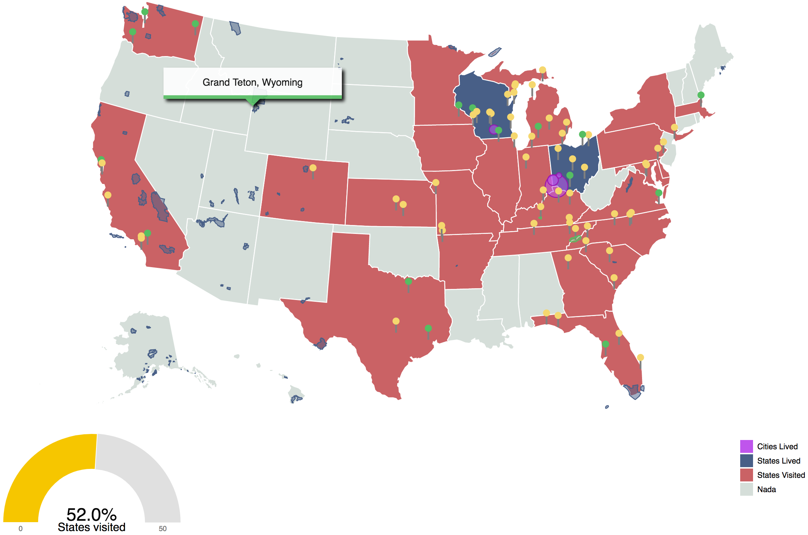

# US-Travel-Map
D3 Generated Travel Map

Generated through D3js.

## Functions

<dl>
<dt><a href="#initialize">initialize()</a></dt>
<dd>
Read in the JSON/CSV data, Render the SVG

</dd>
<dt><del><a href="#renderProgressRing">renderProgressRing()</a></del></dt>
<dd>
Note: Not currently used. Meant to render a percentage of the states traveled to

</dd>
<dt><a href="#getCityVisitedColor">getCityVisitedColor(city)</a> ⇒</dt>
<dd>
Get the fill color of the pinhead based on the reason for visiting it.

</dd>
<dt><a href="#stateType">stateType(type)</a> ⇒</dt>
<dd>
Represents the states in the U.S. and whether I&#39;ve lived there, travelled, or nada

</dd>
<dt><a href="#parkType">parkType(type)</a> ⇒</dt>
<dd>
Read in the park data and return a properly formatted object.

</dd>
<dt><a href="#addTooltipToElement">addTooltipToElement(tooltipElData, isPath)</a></dt>
<dd>
Pass in the dataset you want to display a tooltip over. If the dataset is a park then we&#39;ll
approach it a bit differently.

</dd>
</dl>

## initialize()
Read in the JSON/CSV data, Render the SVG

**Kind**: global function  
**Access**: public  

## ~~renderProgressRing()~~
***Deprecated***

Note: Not currently used. Meant to render a percentage of the states traveled to

**Kind**: global function  

## getCityVisitedColor(city) ⇒
Get the fill color of the pinhead based on the reason for visiting it.

**Kind**: global function  
**Returns**: string - The color of the pinhead  

| Param | Type | Description |
| --- | --- | --- |
| city | <code>Object</code> | The city object with all of its parameters |
| city.City | <code>string</code> | The name of the city visited |
| city.State | <code>string</code> | The state it resides in |
| city.Latitude | <code>number</code> | The latitudal location on earth |
| city.Longitude | <code>number</code> | The longitudinal location on earth |
| city.Reason | <code>string</code> | Reason for visiting (can be Work, Fun) |
| city.Desc | <code>string</code> | Details about the trip |
| city.Link | <code>string</code> | A link to additional information about the trip |
| city.Date | <code>DateTime</code> | The date the city was visited |

## stateType(type) ⇒
Represents the states in the U.S. and whether I've lived there, travelled, or nada

**Kind**: global function  
**Returns**: Object - State object  

| Param | Type | Description |
| --- | --- | --- |
| type | <code>Object</code> | The dataset object |

## parkType(type) ⇒
Read in the park data and return a properly formatted object.

**Kind**: global function  
**Returns**: Object, park object with the properties seen in the code.  

| Param | Type | Description |
| --- | --- | --- |
| type | <code>Object</code> | The park object with its default properties from D3.tsv |

## addTooltipToElement(tooltipElData, isPath)
Pass in the dataset you want to display a tooltip over. If the dataset is a parkapproach it a bit differently.

**Kind**: global function  

| Param | Type | Description |
| --- | --- | --- |
| tooltipElData | <code>any</code> |  |
| isPath | <code>boolean</code> | Is this a geoJSON object or a normal JSON? |
